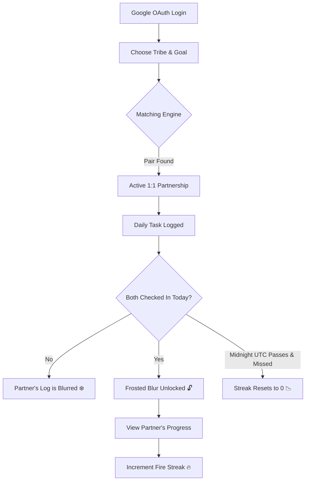

<div align="center">
  
  
  # dot.
  
  ### *Daily progress. Silent support.*
  
  A premium, distraction-free 1:1 anonymous habit accountability partner network.
  
  [](https://github.com/subxm/DOT/stargazers)
  [](https://github.com/subxm/DOT/network/members)
  [](https://github.com/subxm/DOT/issues)
  [](https://github.com/subxm/DOT/blob/main/LICENSE)

  <br />

  [Philosophy](#-the-philosophy) • [The Protocol](#-the-protocol) • [Aesthetics](#-ui--aesthetics) • [Tech Stack](#-technical-architecture) • [Getting Started](#-getting-started)
</div>

---

**dot.** is a premium, distraction-free 1:1 anonymous habit accountability partner web application. Built with **React 19**, **Vite**, **Tailwind CSS v4**, and **Google Identity Services (GSI) OAuth**, it helps users build consistent habits in Coding, Fitness, Writing, and Mindfulness.

Unlike traditional, noisy social tracking apps that distract you with infinite scrolling, comments, and likes, **dot.** is designed around the quiet power of raw output, complete anonymity, and strict reciprocity.

---

## 🌌 The Philosophy

In a world full of social networks designed to capture your attention and sell it, **dot.** is built to protect your focus. We believe that true self-improvement happens in silence and through consistent, daily effort.

*   **Zero Social Noise:** No likes, no comments, no emojis, no feeds. Your buddy's output is all that matters.
*   **Absolute Anonymity:** Real names, email addresses, and photos are completely hidden. You only know your partner by their commitment and their output.
*   **Strict Reciprocity:** You cannot consume without contributing. Your partner's daily update remains blurred until you submit your own.

---

## ⚙️ The Protocol (How it Works)

The workflow is designed to be minimal, clean, and highly motivating. Below is a high-level representation of the matching and check-in protocol:



### 1. Commit
Log in with Google, choose a tribe (💻 Coding, 🏋️ Fitness, ✍️ Writing, 🧘 Mindfulness), and write your daily goal description (max 60 characters).

### 2. Match
The matching engine pairs you with one anonymous partner committing to the same discipline. You cannot see their email, name, or photo—only their goal description.

### 3. Write
Post what you accomplished today toward your goal (max 280 characters) before the countdown reaches `00:00:00 UTC`.

### 4. Reveal
Instantly unblur your buddy's progress log for the day and fuel your shared streak.

---

## 🎨 UI & Aesthetics

The interface is built to feel premium, tactile, and nostalgic, mimicking physical devices and using modern design patterns.

*   **Retro Nokia 3310 Console:** A core visual mockup representing focus. The retro screen dynamically types messaging prompts (`Are you here?`, `Yes, I am.`, `Speak soon.`) to set a quiet, consistent mood.
*   **Polished Glassmorphism:** Translucent UI elements featuring custom background blurs, subtle borders, and smooth hover translations (`backdrop-blur-md bg-white/20 border-black/10`).
*   **Floating Avatar & Status Capsule:** Your Google avatar floats on the extreme right of the viewport, outside the centered capsule Navbar to preserve visual balance.
*   **Consistency Grid:** A calendar grid visible inside your profile slide-out drawer that displays check-in history. Fresh accounts start with 0 check-ins, tracking your genuine streak progress day by day.
*   **Interactive Info Drawer:** Beautiful tabbed modal highlighting:
    *   **The Protocol** (Philosophy & comparisons)
    *   **Trust & Privacy** (Data protection)
    *   **Access & Flow** (Guidelines)
    *   **Tribe Matching** (Rules)

---

## 🛠️ Technical Architecture

**dot.** is built using a modern, performant, and type-safe front-end stack:

*   **Core Framework:** React 19 (TypeScript)
*   **Build Tool:** Vite
*   **Styling:** Tailwind CSS v4 (Vanilla HSL-tailored custom color systems)
*   **Animations:** Framer Motion (`motion/react`)
*   **Authentication:** Direct Google Identity Services (GSI) API token client integration
*   **Database/Backend (Unified API):**
    *   **Live Mode:** Firebase Auth & Firestore real-time snapshot sync (triggered when configuration is present in `.env`).
    *   **Demo/Mock Mode:** High-fidelity in-memory state engine mirrored dynamically in `LocalStorage` with support for profile consistency calendars, matchmaking, notes submissions, and streak calculations.

---

## 🚀 Getting Started

### 1. Clone & Install

```bash
# Clone the repository
git clone https://github.com/subxm/DOT.git
cd DOT

# Install dependencies
npm install
```

### 2. Configure Environment Variables

Create a `.env` file in the root directory and add your Google OAuth Client ID:

```env
VITE_GOOGLE_CLIENT_ID=your-google-client-id.apps.googleusercontent.com
```

> [!NOTE]
> **Optional Live Mode Setup:** If you wish to connect to a live Firebase backend, add your Firebase config keys to `.env`:
> ```env
> VITE_FIREBASE_API_KEY=your-api-key
> VITE_FIREBASE_AUTH_DOMAIN=your-auth-domain
> VITE_FIREBASE_PROJECT_ID=your-project-id
> VITE_FIREBASE_STORAGE_BUCKET=your-storage-bucket
> VITE_FIREBASE_MESSAGING_SENDER_ID=your-sender-id
> VITE_FIREBASE_APP_ID=your-app-id
> ```

### 3. Run Locally

```bash
# Start Vite development server
npm run dev
```
Open `http://localhost:5173` in your browser.

### 4. Build for Production

```bash
# Compile TypeScript and compile assets
npm run build
```
Production assets will be built in the `dist` folder.

---

<div align="center">
  <p>Created with dedication to quiet consistency. ✦</p>
</div>
