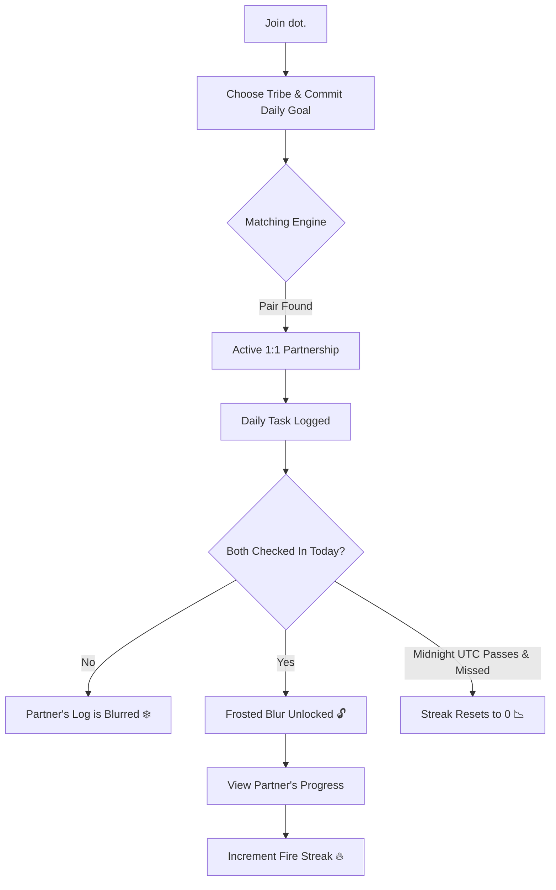

  
  
  # dot.
  
  ### *Daily progress. Silent support.*
  
  A premium, distraction-free 1:1 anonymous habit accountability partner network.

   

---

**dot.** is a quiet space for builders, creators, and individuals dedicated to daily improvement. It is a 1:1 anonymous accountability system that pairs you with one partner who shares your discipline—whether you are Coding, training for Fitness, Writing, or practicing Mindfulness.

Unlike traditional social tracking apps that distract you with infinite scrolling, comments, likes, and vanity metrics, **dot.** is designed around the quiet power of raw output, complete anonymity, and strict reciprocity.

---

## 🌌 Why dot.? (The Philosophy)

In a world full of social networks designed to capture your attention and sell it, **dot.** is built to protect your focus. We believe that true self-improvement happens in silence, away from external validation.

*   **Zero Social Noise:** There are no likes, no comments, no emojis, and no public feeds. Your partner's progress log is the only thing you see.
*   **Absolute Anonymity:** Real names, email addresses, and profile pictures are completely hidden. You only know your partner by their commitment and daily output.
*   **Strict Reciprocity:** You cannot consume without contributing. Your partner's daily update remains hidden behind a frosted blur until you log your own check-in.

---

## ⚙️ How it works (The Protocol)

The flow is designed to be minimal, clean, and highly motivating. Below is the matching and check-in sequence:

### 1. Commit
Choose a tribe (**Coding**, **Fitness**, **Writing**, **Mindfulness**) and define your daily goal (e.g., *"Commit to 2 hours of deep work"*).

### 2. Match
The matching engine pairs you with a single anonymous partner in the same discipline. You cannot see who they are—only their daily goal.

### 3. Log
Post what you accomplished today (maximum 280 characters) before the daily countdown reaches `00:00:00 UTC`.

### 4. Reveal & Fuel
Once you submit your check-in, your partner's log is unblurred. If both of you check in successfully before midnight, your shared **Fire Streak** (`🔥`) increases. If either of you misses a day, the streak resets to zero.

---

  
Created with dedication to quiet consistency. ✦

